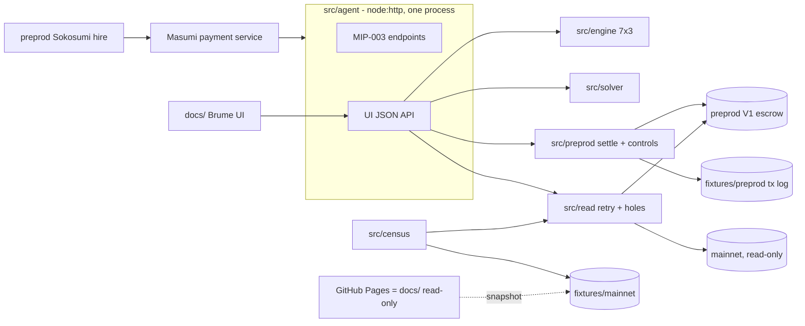

# PLAN — Brume · TOKEN2049 Origins · Cardano track · team BuzzBallz

Window: **Tue 6 Oct 12:00 SGT → Wed 7 Oct 23:59 SGT**. Nothing is committed before 12:00 SGT.
Sources (outside the repo, never committed): `../research/SPEC.md` (v3, 6 Oct), `SPEC-VALIDATOR.md`, `SPEC-TRANSACTIONS.md`, `_recommendation.md`, `04-andrea-context-update.md`.
This file + `CLAUDE.md` are the shared memory. Status: **Phase 1 v3 — awaiting GO for M0.**

---

## 1. Pitch

> A deployed Cardano escrow validator accepts a negotiated exit its authors never built. We derive it from the bytecode, pre-sign the exit before the concession so the conceding party is never exposed to a refusal, and price what remains. *(SPEC §1, verbatim. "Cannot be raced" is retracted and must never appear.)*

**Opener, in the track's words:** "The escrow promises a refund if nothing is delivered. It does everything right up to the last step — and the last step is a transaction that no layer builds. We built it, and we built the negotiated split the validator accepts but no product offers." Bridge within 20 s: every Coworker that gets hired depends on "paid" being true; Brume makes it true when delivery is contested. Tone: contribution, never gotcha.

**What Brume is.** A Coworker on preprod Sokosumi (MIP-003 agent) plus a working UI. Input: an escrow UTxO reference. Output: what each party can do right now (7 redeemers × buyer/seller/admin), the individually-rational split, and the counter-signed exit that settles it. **No model decides anything**: the split comes from the validator's guards and the measured arbitration history, so there is no prompt-injection surface and nobody uploads evidence. **Recursion:** the agent is paid through the escrow it knows how to unstick (literal only if Sokosumi pays into V1, Q-F).

**Four judges:** tooling/infra (mechanism, README), marketplace creator (a real Coworker he would keep running), two business judges (**who pays and why** — new slide), all four (end to end in 3 min). **Honesty line, volunteered:** a measurement of a primitive, not a victim narrative.

## 2. Demo script — 3:00 recorded, product first, proof in the README (organisers' steer)

The UI steps (0:20–2:10) must work perfectly. Exact inputs are fixed in `DEMO.md` at M2.

| t | Screen | Exact action | Point | Owner |
|---|---|---|---|---|
| 0:00–0:20 | preprod Sokosumi | Brume is hired like any agent, delivers; the buyer disputes. Opener line | room expects agents | B |
| 0:20–0:40 | Brume UI | open a real **mainnet** Disputed escrow (read-only) → reachability grid, permitted cells lit | the one visual | A engine · B UI |
| 0:40–1:40 | Brume UI | preprod bank escrow: seller proposes the solver's split → buyer accepts and pre-signs the exit (leg 2) → seller concedes (leg 1) → both legs go out → balances land. Tx hashes visible, not dwelt on | the 30 % criterion | B UI · A tx |
| 1:40–2:10 | Brume UI | "try anyway" on an action the engine marks impossible → submitted → validator refuses | proof in 15 s | A · B |
| 2:10–2:35 | Brume UI | solver panel: executable band, what each side gives up by waiting, fee and exposed party per path, scale-free | no prior art | A solver · B UI |
| 2:35–3:00 | slides | who pays for this (every agent on the marketplace is paid through this escrow) + the ask + repo | business judges | B |

**README carries the rest:** census with tip block, every tx hash, all controls, 5b race measurement, own-deployment admin pair, prior art (Kleros v2, Win-Win, AI Arbiter, Hokan, own-contract projects), rung labels.

## 3. Scope

**MUST (demo path)**
- [ ] M-1 keyless read layer, 429 retry/backoff, hole counter (part 1)
- [ ] M-2 16-field V1 decoder + `census:mainnet` from the UTxO set, two providers (part 2; README evidence, not on camera)
- [ ] M-3 reachability engine 7×3 (part 3)
- [ ] M-4 preprod fast fixture + bank of 6–8 locked escrows (part 4)
- [ ] M-5 two-leg settlement, leg 2 pre-signed; path A fallback (part 5)
- [x] M-6 one accept/refuse control + leg-2 replay refusal (part 10 minimal) — and C11 below
- [ ] M-7 solver core: band, defection payoffs, fee + exposed party per path, scale-free (part 8)
- [ ] M-8 agent server: MIP-003 endpoints + UI API, one process (`src/agent`)
- [ ] M-9 Brume UI: escrow, grid, propose/accept/sign, submit, balances, solver panel; read-only mode on GitHub Pages
- [ ] M-10 Coworker registered and listed on preprod Sokosumi (part 5c)
- [ ] M-11 README (5 commands, mocks, tx hashes, prior art), DEMO.md, pinned fixtures (part 11)
- [ ] M-12 recording + slides incl. "who pays" (part 12)

**SHOULD (in this order)**
- [x] S-1 race measurement 5b (A, 1 h). Until run, say nothing about racing — ONE run, 6 Oct, `fixtures/preprod/race-18268b5a…_0.json` (§10)
- [x] S-2 own deployment (key ×3, threshold 2): admin pair `WithdrawDisputed` before/after concession (A) — pair done 6 Oct, blocks 5259662 (accepted) / 5259664 → refused (phase 2). The other unavailable branches are the C11 controls on the shared script (§10: SetRefundRequested clean; the two seller branches re-run with the guard isolated)
- [ ] S-3 CIP-30 browser signing (upgrade of the file-drop path; only if core done)
- [ ] S-4 solver hazard term (option to wait, one-sided arrival bound)
- [ ] S-5 `verify <txhash>` judge script; solver over all 61 as fixture
- [ ] S-6 CIP-8 signed proposal/accept (part 6)
- [ ] S-7 x402 payment via the **hosted** facilitator (optional, never a gate)

**WON'T**
- V2 escrow support (19 fields) — build against V1 whatever Sokosumi uses
- any mainnet write or evaluation; any write to the platform's API
- an LLM deciding anything; a database; Vercel; a UI framework
- dollar sums anywhere; the words "cannot be raced"; the 26.4 % admin figure outside the repo

## 4. Architecture

**Stack.** TypeScript on **Node ≥ 22.18** (native type stripping, no build), pnpm, `node --test`. **MeshSDK pinned exactly** `@meshsdk/core@1.9.0-beta.96` + `@meshsdk/core-cst@1.9.0-beta.90`, lockfile committed (a bump changes V1 address derivation and CBOR). Evolution SDK only as fallback, never mixed. Server: `node:http`, no framework. UI: static HTML + vanilla JS in `docs/`. Providers: Koios keyless + Blockfrost (key, both networks). Funding: `dispenser.masumi.network`, testnet faucet as fallback.
Type stripping: no `enum` / `namespace` / parameter properties; imports end in `.ts`.

**Contracts.** None written. Target: deployed V1 validator (`bd2adb68…6c0`, same hash on preprod and mainnet). Redeemers `0 Withdraw · 1 SetRefundRequested · 2 UnSetRefundRequested · 3 WithdrawRefund · 4 WithdrawDisputed · 5 SubmitResult · 6 AuthorizeRefund`. Demo path 1 → 6 → 3; fallback 2 → 0.
**Datum: 16 fields, in order** (SPEC-TRANSACTIONS §0): 0 buyer (Address) · 1 seller (Address) · 2 reference_key · 3 reference_signature · 4 seller_nonce · 5 buyer_nonce · 6 collateral_return_lovelace · 7 input_hash · 8 result_hash · 9 pay_by_time · 10 submit_result_time · 11 unlock_time · 12 external_dispute_unlock_time · 13 seller_cooldown_time · 14 buyer_cooldown_time · 15 state. Public examples use 11 fields, so their indices are wrong. `buyer`/`seller` are nested Address constructors, times in ms. Redeemers are bare constructors, no fields.
**Every tx** through one helper: default validity window ≈ now − 150 s / now + 150 s (each nudged one slot outward, converted to slots); continuation datums write cooldown = **the tx upper bound + 35 min**, never the computed minimum and never relative to now (`current_time` = upper bound feeds the cooldown); pre-signed legs carry their own window (leg 1 upper ≈ now + 20 min, `leg2.validToMs` > `leg1.validToMs` + confirmation margin), same cooldown rule; collateral provided; explicit lower bound on `must_start_after` branches, strict `must_end_before`, signer in required signers, one escrow input, ≤ 1 escrow output, no reference script; preprod-only guard.

**Leg-2 construction (confirmed by A2, 6 Oct 13:50 SGT, preprod block 5259491).** Leg 2 spends the leg-1 output + a fee/collateral input owned by the **seller**; required signer = buyer; buyer signs first, seller adds its witness later. **The first mover signs leg 1 only inside `submit()`**, after verifying the counterparty's witness on leg 2 (in the CBOR, not `signedBy`) and that leg 2 spends `leg1.txHash#idx`; a Proposal or file never carries a signed leg 1, or its holder could submit the concession alone. Path A mirrored (buyer is the first mover, seller pre-signs Withdraw, buyer-owned funding inputs). Legs submitted chained, back to back, same node: favourable, not a guarantee (S-1 measures).

**Signature path.** Guaranteed: file drop. The UI writes `proposal.json` / unsigned tx; each party signs with `pnpm sign --role buyer|seller <file>`; the UI picks up the signed file. Upgrade: CIP-30 (S-3). For the recording both demo wallets are ours (stated in DEMO.md).

**Own deployment (S-2).** The committed V1 blueprint (unapplied hash `e6d17c48…0795`, Aiken v1.1.7) with **our** params applied by `@meshsdk/core-cst@1.9.0-beta.90` (`admin_vks` = our key ×3, threshold 2). Same call with the deployed params must first reproduce `bd2adb68…6c0` (control, §10). Vendored in `vendor/` with PROVENANCE.md (licence, source commit, unmodified). Labelled on camera as our own deployment: same compiled code, our parameters.

**`/shared` contract (M0, changes logged in §11)**
- `shared/types.ts` — `Network`, `Datum` (16 fields from SPEC-TRANSACTIONS §0), `State`, `Redeemer`, `Role`, `Verdict`, `Grid`, `Census`, `SolverInput/Output`, `TxLogEntry`, `Params`, `Proposal {escrowRef, network, path, sellerShare, payout, leg1?, leg2?, signedBy}`, `JobResult` (MIP-003 output: verdict + split + UI link).
- `shared/constants.ts` — script hash, V1 addresses, deployed params with rung, USDM policy, provider URLs.
- `shared/mock/*.mock.json` — one real Disputed UTxO, decoded datum, grid, census, solver output, proposal, tx log, job result.
- Signatures (owner implements, other imports):
  - B `src/read`: `utxosAt(net, addr)`, `utxo(net, ref)`, `tx(net, hash)`, `tip(net)` → each with `holes`
  - B `src/census`: `decodeDatum(cborHex) → Datum` (throws)
  - A `src/engine`: `reach(datum, value, nowMs, params) → Grid`
  - A `src/solver`: `solve(SolverInput) → SolverOutput`
  - A `src/preprod`: `prepare(escrowRef, sellerShare) → Proposal`, `sign(role, Proposal) → Proposal`, `submit(Proposal) → TxLogEntry[]`, `tryAnyway(escrowRef, redeemer, role) → TxLogEntry`

**Solver model (A owns).** Fee: path A `floor(q·φ/1000)` every asset, path B 0. Leg-2 defection: path A seller keeps `V − fee − c`, buyer floor `c` lovelace / 0 token; path B buyer keeps `V`, seller floor 0. Reservations: `r_s = 0` (0/120); `r_b = π_a·(1 − e^(−λ̄H))`, `π` = ADA 100 % / token 73.6 %, `λ̄ = ln 20 / T`, `H` ∈ {7, 30, 90} d. Front-run probability `p` shown at worst case until S-1 measures it. Output per unit of V, never dollars. Bands are per path (`SolverOutput.path`): path B per-unit max = 1 − r_b; path A pot = V − fee and the buyer keeps ≥ c lovelace, so per-unit max = 1 − φ/1000 − r_b and lovelace max ≤ (V_l − fee_l − c)/V_l. A band can be infeasible (`feasible: false`) and path A may need a `topUp`. The share reaching neither party in arbitration is a solver term only, never an output field (§3 WON'T).

## 5. Streams — zero file overlap

| | Stream A — tx, engine, solver | Stream B — read, agent, UI, product |
|---|---|---|
| Owner | **Alexandre** (holds preprod escrow keys) | **Andrea** |
| Branch | `a/tx` | `b/ui` |
| Owns | `src/engine/`, `src/solver/`, `src/preprod/`, `fixtures/preprod/`, `vendor/` | `src/read/`, `src/census/`, `src/agent/`, `docs/`, `fixtures/mainnet/`, `deck/`, `README.md`, `DEMO.md` |
| Load (h) | ≈ 15.5 MUST + 2.5 SHOULD | ≈ 15.5 MUST |

Solver moved to A (quant home ground, balances load now that B carries the agent, 5c and the UI). **Shared** (change = §11 entry + both agree): `shared/`, `package.json`, lockfile, `tsconfig.json`, `.gitignore`, `.env.example`, `.githooks/`, `PLAN.md`, `CLAUDE.md`, `.claude/`.
**Sync points:** Tue 18:00 · Tue 23:30 · Wed 08:00 · Wed 13:00 (freeze) · Wed 17:30. Merge `main` into your branch → `pnpm check` green → merge into `main` (no squash, no force).

## 6. Milestones (SGT)

**M0 — Skeleton + shared contract · Tue 12:00–13:00 · both**
- [x] A+B: `shared/types.ts` with the 16 datum fields of §4 (A reviews) [opus/high] — A's revision logged in §11, awaiting B
- [ ] B: `package.json` (all scripts, Mesh exact pins), `tsconfig.json`, `.gitignore`, `.env.example`, `.githooks/pre-commit` secret grep [haiku]
- [ ] B: one real Disputed UTxO (Koios + Blockfrost) + mocks in `shared/mock/` [haiku]
- [ ] A+B: `shared/constants.ts` [sonnet/medium]
- [x] A: kickoff freshness output → `fixtures/kickoff-2026-10-06.md` (no probe code) [haiku] — tip 14031823 → 14031828
- [ ] B: start 5c early: Coworker API opens at 12:00; dispenser-fund the Masumi wallets [—]
- Done when: first commit ≥ 12:00, `pnpm check` green, branches created.

**M1 — Ugly end-to-end · Tue 13:00 → Wed 00:00 · spike gate 18:00**
- [x] A1 tx helper + preprod guard [opus/high] — no tx without upper bound (test) — `src/preprod/tx.ts`, 28 tests; first tx block 5259438
- [x] A2 **spike by 18:00** [opus/high, ultrathink] — SPEC §5 part 5. Fail → path A — **PASSED 13:50 SGT, path B**: leg 2 signed against leg 1's future output, both legs in block 5259491, replay refused (phase 1). `fixtures/preprod/txlog-spike-6d3b12d4…_0.json`
- [x] A3 fixture + bank [sonnet/high] — target state < 5 min, twice — incl. 2 bank escrows locked to B's wallet 1 (buyer) / wallet 2 (seller) from DEMO.md, so B can run the settle and the video on B's machine
- [x] A4 engine [sonnet/high + contract-reviewer] — all redeemer × role tested; one predicted refusal refused on preprod
- [ ] A5 `prepare/sign/submit/tryAnyway` + `pnpm sign` file drop [sonnet/high]
- [ ] B1 read layer [sonnet/medium] — forced 429 retried and counted; nonexistent ref → 0 rows
- [ ] B2 decoder + census [sonnet/high] — totals = UTxO sum on both providers; corrupted datum fails; 141 open / 140 decoded reproduced against `fixtures/kickoff-2026-10-06.md`
- [ ] B3 agent server: UI API over mocks, then real calls [sonnet/medium]
- [ ] B4 UI v0: escrow + grid + propose/accept/sign/submit flow over mocks [sonnet/medium]
- [ ] B5 5c: Masumi payment service, agent registered, MIP-003 endpoint answering, listed on preprod Sokosumi [sonnet/high] — done when a hire from Sokosumi reaches `/start_job`
- Done when (**Integration 1, 23:30**): on A's machine, the UI runs the full settle flow on a bank escrow end to end; grid on a real mainnet escrow; Sokosumi hire reaches the agent.

*Sleep Wed 00:00–05:00. Non-negotiable.*

**M2 — First complete ugly take · Wed 05:00–09:00**
- [ ] A solver core [sonnet/high] — hand-computed case passes
- [ ] A control "try anyway" + S-1 race measurement [sonnet/high]
- [ ] B solver panel + balances + tx links in UI; GitHub Pages read-only mode [sonnet/medium]
- [ ] B pin fixtures, pick `<HERO_REF>` and `<BANK_REF>`, log in §10 [haiku]
- [ ] A+B ugly take following §2
- Done when: a complete 3-min take exists (**hour-20 question: yes**).

**M3 — Integration + freeze · Wed 09:00–13:00**
- [ ] B clean-clone judge run (keyless): README commands work [sonnet/high]
- [ ] A S-2 own deployment + admin pair [sonnet/high + contract-reviewer]
- [ ] B S-3 CIP-30 only if everything above is green [sonnet/high]
- [ ] `/code-review high` + contract-reviewer on `src/preprod`, `src/engine`, `src/agent`; claims-checker on README/deck draft
- Done when: **freeze 13:00**, main green.

**M4 — Polish · Wed 13:00–17:30**: UI polish (minimalist-ui, dataviz), deck incl. who-pays slide, take 2.
**M5 — Ship (≈ 18 % buffer) · Wed 17:30–23:59**: final take by 20:00, README + DEMO.md final, claims-checker pass, **repo switched to public**, submit by 22:00.

## 7. Models & effort
Rubric as given, with: engine and solver → sonnet/high + opus review (fully specified, review catches what matters); decoder → sonnet/high (tag-121 silent zeros); README/deck/voiceover → sonnet/medium (phrasing is a scoring risk). Session: `/model opusplan`, `/effort medium`, plan mode at each milestone start. "ultrathink" only for: A2 leg-2 design, A4 guard encoding review, solver model changes, cross-stream integration failures, final claims audit. fable: never without approval.

## 8. Subagents
`explorer` (haiku/low), `implementer` (sonnet/medium), `contract-reviewer` (opus/high), `claims-checker` (sonnet/medium). Max 2 in parallel, independent tasks only, announced with count and reason.

## 9. Risks & fallbacks

| # | Risk | Fallback | Switch |
|---|---|---|---|
| R-1 | Koios mainnet 429 / drops | retry + holes; pinned snapshot | `READ_SOURCE=fixture` |
| R-2 | Blockfrost down / no key | "2nd provider: skipped" printed as a hole | key unset |
| R-3 | Koios preprod drops submits | submit via Blockfrost; bank absorbs failed takes | `SUBMIT_VIA` |
| R-4 | Path B refused | path A (executed wave 2) | `SETTLE_PATH=B\|A` |
| R-5 | Masumi registration / Sokosumi listing blocks (5c) | demo opens on our agent's MIP-003 endpoint hired by a scripted call; Sokosumi shown as screenshot | `HIRE_VIA=sokosumi\|direct` |
| R-6 | Sokosumi pays into V2 (Q-F) | recursion line dropped; mechanism stays on our V1 bank escrows | — |
| R-7 | CIP-30 wallet quirks | file-drop signing (default) | `SIGNER=file\|cip30` |
| R-8 | Hosted x402 facilitator | not on any path | `X402=off` |
| R-9 | Alexandre's Node < 22.18 | `npx tsx` | — |
| R-10 | Admin control on the shared script proves nothing | S-2 own deployment | — |
| R-11 | Front-run on leg 2 | never claimed; S-1 measures; solver prices `p` | — |
| R-12 | Mesh drift | exact pins, lockfile | — |
| R-13 | No complete take at h20 | stop building, record | — |
| R-14 | B carries the critical-path UI and 5c | census polish and `show` dropped; CIP-30 SHOULD | — |

Mocks only in `shared/mock/*.mock.json`, each listed in the README.

## 10. Open questions and decisions

**Open**
- Q-F Which escrow does Sokosumi preprod pay into, V1 or V2? (Alexandre asking the marketplace creator.) Build against V1 either way. **Probably V2** (B, 6 Oct): the Masumi payment service's default seed installs Web3CardanoV2; V1 only with `SEED_V1_LEGACY=true`. If confirmed, R-6 applies: the literal recursion line is dropped from the pitch.
- Q-C Seller preprod wallet funded (dispenser), in ≥ 2 independent UTxOs (A2 two-UTxO rule)?
- Q-K (A raises, B decides with A) K45 / C14 look wrong: the deployed V1 bytes ARE reproduced (see "Measured 6 Oct" below). Wording rule unchanged until the team agrees: "the validator's source says" until a guard has run on preprod.

- Q-R (A raises; from the guard table, R4, not yet exercised) SPEC-VALIDATOR §5 says path A's leg 1 is reversible and keeps arbitration reachable. Past `unlock_time` (all 61 live disputed escrows) neither holds: `SetRefundRequested` needs upper < `unlock_time`, and after `UnSetRefundRequested` the state is `ResultSubmitted`, not `Disputed`. So pre-signing is as mandatory on path A as on path B. Path A bank escrows must be past `unlock_time` and past `buyer_cooldown_time` (≈ 35 min after the dispute). Correct before the solver or the pitch cites reversibility.

**A2 gate decisions (written 6 Oct ~13:55 SGT, gate passed early)**
- D13 **Input ownership and the two-UTxO rule.** Leg 2's fee and collateral inputs belong to the party that concedes in leg 1 (the seller on path B): with the buyer's own inputs, the buyer could kill leg 2 at zero cost by spending them elsewhere and keep the option to take everything later; with the seller's, the residual risk is a front-run (S-1 measures it). The buyer signs leg 2's body (required signer), the seller adds its witness over the same body, so the body is final when the buyer signs. The seller holds ≥ 2 independent UTxOs and leg 1 never spends any input or collateral leg 2 names; checked from both bodies before leg 1 is signed. The first mover signs leg 1 only inside `submit()`. Path A mirrored.
- D14 **Solver model.** r_s = 0 (the seller received nothing in 120 of 120 arbitrations). r_b from the MEASURED split per asset: buyer 100 % of the ADA, 73.6 % of the token (not a generic π), times (1 − e^(−λ̄H)), λ̄ = ln 20 / T, T = 313 d (95 % upper bound for zero events), H ∈ {7, 30, 90} d. The 26.4 % of the token pot that reached NEITHER party in arbitration is the term that keeps settlement rational for both even if arbitration arrived for sure; it stays a solver term, never an output field. Front-run p at worst case (1) until 5b measures it.
- D15 **Q-H slot constants** (below, measured at 0 s error) and **every script tx's integrity hash recomputed with the chain's PlutusV3 cost model** (Mesh beta.96 ships 297 entries, preprod has 350).

**Executed on preprod, 6 Oct (A)** — the accept side of three guards, against the shared V1 script (`bd2adb68…`, the same bytes as mainnet). For these three branches the phrasing may now be "the deployed bytes accept"; refusal controls and the other branches are still "the validator's source says".
- `SetRefundRequested` from `ResultSubmitted` with a result hash → `Disputed` (block 5259468; the first attempt was a phase-1 ledger refusal from Mesh's stale cost model, kept in the log).
- `AuthorizeRefund` from `Disputed` → `RefundRequested`, result hash emptied (leg 1, block 5259491).
- `WithdrawRefund` from `RefundRequested`, paying 40 % of the pot to the seller: no fee output, no collateral output (leg 2, block 5259491). This is C8 executed: the exit was signed against an output that did not exist yet. It removes a refusal; it says nothing about a front-run.
- Leg 2 replayed byte for byte: refused by the ledger (phase 1, inputs spent), not by the validator.
- **First refusal by the deployed bytes (A4 done-when):** the engine predicted the buyer cannot take `WithdrawRefund` while `Disputed`; built and sent anyway (`tryAnyway`, no evaluation, the node ran the script), it was refused in phase 2 (`ValidationTagMismatch (IsValid True) … PlutusFailure`) on bank escrow `8e0d6df4…#0`. Rejected from the mempool, no collateral taken.
- A5 file-drop path end to end on a token pot (`pnpm sign --prepare / --role buyer / --role seller`): both legs in block 5259570, 8 tADA + 4 tUSDM to the seller, 12 tADA + 6 tUSDM to the buyer.
- Both legs landed in the same block, handed 668 ms apart to one Koios node. One run: favourable, not a race measurement (S-1).

**S-1 race, 6 Oct, 5 runs** (`fixtures/preprod/race-*.json`; 4 of the 5 contended — the run in block 5259678 was not — one of them run from the second session). **Same block, 5 of 5** (blocks 5259678, 5259750, 5259751, 5259754, 5259799): leg 2 accepted 503–711 ms after leg 1 was sent, both handed to one provider — **R5, sayable.** **Front-run: still unmeasured.** A rival pre-built by the buyer (its own `WithdrawRefund` taking the whole pot, evaluated as a valid exit against leg 1's pending output before each run: the positive control that a refusal is not a malformed rival) never landed, but no run gave it a clean window: run 1 watched a mempool that could not see leg 1 (first sight after the block); in runs 2–4 it saw leg 1 in Blockfrost's mempool at +314 to +1063 ms and fired through Koios, whose node had not yet received leg 1 (`BadInputsUTxO` on leg 1's own txid), and the first fixed-transport retries were cut off when the block landed (+1.1 s in run 4). **What the numbers do say:** the attack window is the seller's gap between leg 1 and leg 2 at one endpoint (249–296 ms across the contended runs) against an attacker watching that endpoint (first sight ~300 ms here) — the same order of magnitude, so **no safety claim**. **Not sayable:** "the rival was refused N/N", any probability, "cannot be raced". The solver keeps p at its worst case (1).

**C11 on the shared script, first run, 6 Oct** (`fixtures/preprod/txlog-c11-8e0d6df4…_0.json`): after the seller's `AuthorizeRefund` alone, `SetRefundRequested` (buyer) was refused by the validator with the state guard as the only failing one — **clean, R5**. `SubmitResult` and `AuthorizeRefund` (seller) were also refused, but **while the seller cooldown armed by the concession was still running**, so the cooldown alone explains them: **guard not isolated, still R4** (review, 6 Oct). Then the buyer's `WithdrawRefund` — accepted (block 5259675). An isolated re-run (concession with a minimal cooldown, controls sent after it expires) is below. `Withdraw` not sent (its mandatory tagged outputs would decide): R4. The admin branch is R5 on our own deployment only; on the shared script it stays "the validator's source says".

**C11 isolated re-run, 6 Oct** (`fixtures/preprod/txlog-c11-isolated-7e37dc3f…_0.json`): the concession written with the minimal seller cooldown (upper bound + 7 min + 1 min), each seller control sent only once the engine named no cooldown: `SubmitResult` (seller) refused by the validator with the emptied result hash as the only failing guard, `AuthorizeRefund` again (seller) refused with the state as the only failing guard (both phase 2); then the buyer's `WithdrawRefund`, accepted (block 5259786). **The two seller branches are now R5 on the shared script**; with `SetRefundRequested` (first run) and `WithdrawDisputed` on our own deployment, C11 is R5 for every branch but `Withdraw` (R4).

**C11 Withdraw + C12, 6 Oct** (`fixtures/preprod/txlog-c11-withdraw-9054b1d8…_5.json`): on an escrow whose `unlock_time` had passed, after the seller's concession alone, the seller's `Withdraw` built with BOTH mandatory outputs (fee output to the fee address carrying `floor(q × 50 / 1000)` of every asset, buyer output carrying `c` lovelace, both tagged with the escrow's own output reference) — **refused by the validator** (phase 2), the engine naming only the concession's effects ("needs ResultSubmitted (is RefundRequested); needs a result hash"). **Positive control:** the same output construction on an escrow where `Withdraw` is open (ResultSubmitted, unlock_time past) — **accepted** (block 5259933), so the refusal is the guards, not a malformed tx. **C11 is now R5 for every branch** (`WithdrawDisputed` on our own deployment), and **C12's fee rule ran on the deployed bytes** (R5: 5 % of every asset to the fee address, the collateral floor lovelace-only).

**Executed on OUR OWN DEPLOYMENT (S-2), 6 Oct** — the vendored V1 blueprint with the deployed fee address, fee permille and cooldown, and only the admin set changed to our admin key ×3, threshold 2: script `d2e72e104b6b4908412f0facfd669821c3587819179ec8d0acf1400d`, address `addr_test1wrfwwtssfd45jzzp9u86eltxnqsuxkrcryteajxs4nc5qrgfenf83` (`fixtures/preprod/own-deployment.json`, log `txlog-own-deployment.json`). Two identical Disputed escrows, arbitration window open:
- X: the admin's `WithdrawDisputed` before any concession — **accepted** (block 5259662), as the engine predicted.
- Y: the seller's `AuthorizeRefund` (block 5259664), then the same admin's `WithdrawDisputed` — **refused by the validator** (phase 2, `ValidationTagMismatch (IsValid True) … PlutusFailure`), as predicted: "needs Disputed (is RefundRequested); needs a result hash". Then the buyer's `WithdrawRefund` on Y — accepted (block 5259665): after the concession only the buyer moves the value.
- Wording: "on our own deployment of the same compiled code" — R5 on our copy; on the shared script the admin branch is still "the validator's source says" (its keys are Masumi's).

**Tooling traps met in A1–A2 (each fixed in `src/preprod`, each would have cost an hour later)**
- `import … from '@meshsdk/core'` fails under Node: its ESM build pulls a libsodium file that is not shipped. Mesh is loaded through its CJS build (`src/preprod/mesh.ts`).
- Mesh's Koios provider sends an auth header that Koios refuses (403): submits are posted raw (`application/cbor`). A 403 is a hole, never a refusal.
- Blockfrost's address listing still showed an input spent one block earlier: every UTxO we spend is cross-checked on Koios (`liveUtxos`).
- Mesh beta.96 hashes script data with a stale PlutusV3 cost model → `ScriptIntegrityHashMismatch` on every script tx; recomputed with the chain's.
- Mesh drops the inline datum when it turns a chained tx into Blockfrost's `additionalUtxoSet`, so leg 2 could not be evaluated; leg 2 is evaluated by our own call, twice, before leg 1 is signed.

**Measured 6 Oct (A, read-only)**
- Q-H settled: preprod slot = 86400 + (POSIX s − 1655769600), 1 s slots. Koios preprod tip block 5259347: `abs_slot − (block_time − 1655769600) = 86400`, 0 s error; epoch 317 / epoch_slot 276622 consistent.
- V1 params R5 by address reproduction: the committed V1 blueprint (`e6d17c48…0795`, the hash Aiken v1.1.7 rebuilds from source, K42) + `applyParamsToScript` from `@meshsdk/core-cst@1.9.0-beta.90` with `[2, [fc16a1fc…, 7f781613…, 89eef9ea…], fee address, 50, 420000]` gives exactly `addr_test1wz7j4kmg…` and `addr1wx7j4kmg…` (6,326-byte applied hex). The same call through `@meshsdk/core` (core-cst beta.96) gives 6,011 bytes and another address. **Rule: apply params only via the direct `@meshsdk/core-cst` import (beta.90); pass only hex strings between the two copies.**
- Signing: `chacha-native`'s build is skipped, so `chacha` (used only by `@cardano-sdk/key-management`) runs its pure-JS fallback. MeshWallet signing goes through libsodium. Offline check with throwaway keys: two partial signatures (buyer then seller) leave the tx hash and body bytes unchanged, both witnesses verify, the wrong-message control fails.
- Key format (A1): `PREPROD_*_SKEY` = bech32 root key with the `xprv` prefix (CIP-1852 account 0 / key 0, same address as the original mnemonic). The pre-commit hook matches that prefix; a mnemonic would not be caught, so mnemonics never go in `.env`.

**Settled 6 Oct**: split A/B · MeshSDK pinned · "cannot be raced" retracted · name **Brume** (repo `BuzzBallz/Brume`, private → public at M5) · S1 naming allowed (Masumi + the contract; money rule kept) · S2 x402 optional, hosted facilitator · demo = end-to-end product, proof in the README · prior art checked by hand (Kleros v2, Win-Win F6, F11 escrow, AI Arbiter, Warden, Trulo, KARMA, NoxEscrow: all build their own escrow or a better judge).

**Decisions**
- D1 TS / Node ≥ 22.18, pnpm, `node --test`, no build.
- D2 One UI in `docs/`: live mode against the local agent server, read-only snapshot mode on GitHub Pages (project link).
- D3 Agent = one `node:http` process serving MIP-003 + UI API.
- D4 Signing: file drop first, CIP-30 upgrade.
- D5 No second partner track.
- D6 Two decoders: Koios `inline_datum.value` vs local CBOR decode of Blockfrost.
- D7 Engine + solver in A; agent + UI in B.
- D8 Solver model §4.
- D9 Arbiter dormancy: pinned walk + live incremental check since the pinned block.
- D10 No AI attribution trailers.
- D11 Keyless census; key-bearing commands take the judge's own funded preprod wallet.
- D12 Own deployment vendored with licence + commit.

## 11. `/shared` change log

| When (SGT) | Change | By | Agreed |
|---|---|---|---|
| Tue 13:05 | `types.ts`: `Params` type; `Reach` takes `params` (as §4 already says) — our own deployment has other admins | A | B, 13:30 |
| Tue 13:05 | `types.ts`: `Proposal` gets `path`, `payout` (exact amounts) and `Leg {redeemer, cborHex, txHash, validFromMs, validToMs, inputs}` (additive: `txHash`, `signedBy`, `sellerShare` unchanged for the UI). `signedBy` is UI state only: `submit()` verifies the witnesses inside the CBOR | A | B, 13:30 |
| Tue 13:05 | `types.ts`: solver per asset — `SolverInput.sellerArbShare`; `Band.perUnit` (r_b, r_s, band per unit), `arbitrationLeak`, `frontRunP {used, measured}`; scalar band kept for the UI slider | A | B, 13:30 |
| Tue 13:05 | `types.ts`: `TxLogEntry` gets `network`, `atMs`, `expected?`, `stage?`, `blockHeight?` — a refusal shown on camera must be `stage: 'submit'` | A | B, 13:30 |
| Tue 13:05 | `constants.ts`: `PARAMS` typed `Params`, admin key hashes + fee credentials added, all R5 (§10); `FEE_ADDRESS` per network; `SELLER_ARB_SHARE` | A | B, 13:30 |
| Tue 13:05 | `shared/mock/` proposal, solver, txlog follow the new shapes | A | B, 13:30 |
| Tue 13:05 | `.env.example`: key format stated (`xprv` root key); `.claude/agents/claims-checker.md`: dead 132/131 replaced by the kickoff pin | A | B, 13:30 |
| Tue 13:25 | after independent review: `SolverOutput.path` + `Band.feasible` + `PathTerms.topUp` (bands differ by path); `arbitrationLeak` removed from the shared output (it would reach the MIP-003 result, §3 WON'T); `TxLogEntry` gets `scriptHash`, `redeemer?`, `role?`, `via?`, `block {height, hash, slot}` (replaces `blockHeight`), `refusal {phase 1\|2, ledgerError}`, `stage` required — only phase 2 is "the validator refuses"; `Reach` documents its window; the first-mover signing rule (§4); `readback.balances?` (B's request) | A | B, 13:40 |
| Tue 14:50 | `constants.ts`: `TUSDM` (preprod USDM unit, now in the bank escrows) and `DECIMALS` { lovelace, USDM, tUSDM: 6 } for display (B's request) | A | B, 14:50 |
