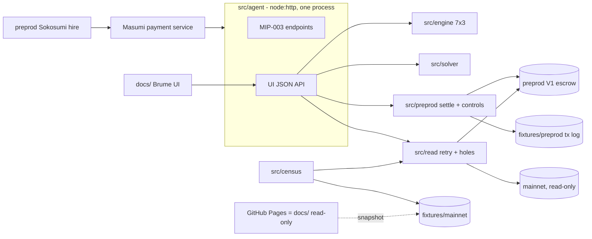

# PLAN — Brume · TOKEN2049 Origins · Cardano track · team BuzzBallz

Window: **Tue 6 Oct 12:00 SGT → Wed 7 Oct 23:59 SGT**. Nothing is committed before 12:00 SGT.
Sources (outside the repo, never committed): `../research/SPEC.md` (v3, 6 Oct), `SPEC-VALIDATOR.md`, `SPEC-TRANSACTIONS.md`, `_recommendation.md`, `04-andrea-context-update.md`.
This file + `CLAUDE.md` are the shared memory. Status: **Phase 1 v3 — awaiting GO for M0.**

---

## 1. Pitch

> A deployed Cardano escrow validator accepts a negotiated exit its authors never built. We derive it from the bytecode, pre-sign the exit before the concession so the conceding party is never exposed to a refusal, and price what remains. *(SPEC §1, verbatim. "Cannot be raced" is retracted and must never appear.)*

**Opener, in the track's words:** "The escrow promises a refund if nothing is delivered. It does everything right up to the last step — and the last step is a transaction that no layer builds. We built it, and we built the negotiated split the validator accepts but no product offers." Bridge within 20 s: every Coworker that gets hired depends on "paid" being true; Brume makes it true when delivery is contested. Tone: contribution, never gotcha.

**What Brume is.** A Coworker on preprod Sokosumi (MIP-003 agent) plus a working UI. Input: an escrow UTxO reference. Output: what each party can do right now (7 redeemers × buyer/seller/admin), the individually-rational split, and the counter-signed exit that settles it. **No model decides anything**: the split comes from the validator's guards and the measured arbitration history, so there is no prompt-injection surface and nobody uploads evidence. **Recursion:** the agent is paid through the escrow it knows how to unstick (literal only if Sokosumi pays into V1, Q-F).

**Four judges:** tooling/infra (mechanism, README), marketplace creator (a real Coworker he would keep running), two business judges (**who pays and why** — new slide), all four (end to end in 3 min). **Honesty line, volunteered:** a measurement of a primitive, not a victim narrative.

## 2. Demo script — 3:00 recorded, product first, proof in the README (organisers' steer)

The UI steps (0:20–2:10) must work perfectly. Exact inputs are fixed in `DEMO.md` at M2.

| t | Screen | Exact action | Point | Owner |
|---|---|---|---|---|
| 0:00–0:20 | preprod Sokosumi | Brume is hired like any agent, delivers; the buyer disputes. Opener line | room expects agents | B |
| 0:20–0:40 | Brume UI | open a real **mainnet** Disputed escrow (read-only) → reachability grid, permitted cells lit | the one visual | A engine · B UI |
| 0:40–1:40 | Brume UI | preprod bank escrow: seller proposes the solver's split → buyer accepts and pre-signs the exit (leg 2) → seller concedes (leg 1) → both legs go out → balances land. Tx hashes visible, not dwelt on | the 30 % criterion | B UI · A tx |
| 1:40–2:10 | Brume UI | "try anyway" on an action the engine marks impossible → submitted → validator refuses | proof in 15 s | A · B |
| 2:10–2:35 | Brume UI | solver panel: executable band, what each side gives up by waiting, fee and exposed party per path, scale-free | no prior art | A solver · B UI |
| 2:35–3:00 | slides | who pays for this (every agent on the marketplace is paid through this escrow) + the ask + repo | business judges | B |

**README carries the rest:** census with tip block, every tx hash, all controls, 5b race measurement, own-deployment admin pair, prior art (Kleros v2, Win-Win, AI Arbiter, Hokan, own-contract projects), rung labels.

## 3. Scope

**MUST (demo path)**
- [ ] M-1 keyless read layer, 429 retry/backoff, hole counter (part 1)
- [ ] M-2 16-field V1 decoder + `census:mainnet` from the UTxO set, two providers (part 2; README evidence, not on camera)
- [ ] M-3 reachability engine 7×3 (part 3)
- [ ] M-4 preprod fast fixture + bank of 6–8 locked escrows (part 4)
- [ ] M-5 two-leg settlement, leg 2 pre-signed; path A fallback (part 5)
- [ ] M-6 one accept/refuse control + leg-2 replay refusal (part 10 minimal)
- [ ] M-7 solver core: band, defection payoffs, fee + exposed party per path, scale-free (part 8)
- [ ] M-8 agent server: MIP-003 endpoints + UI API, one process (`src/agent`)
- [ ] M-9 Brume UI: escrow, grid, propose/accept/sign, submit, balances, solver panel; read-only mode on GitHub Pages
- [ ] M-10 Coworker registered and listed on preprod Sokosumi (part 5c)
- [ ] M-11 README (5 commands, mocks, tx hashes, prior art), DEMO.md, pinned fixtures (part 11)
- [ ] M-12 recording + slides incl. "who pays" (part 12)

**SHOULD (in this order)**
- [ ] S-1 race measurement 5b (A, 1 h). Until run, say nothing about racing
- [ ] S-2 own deployment (key ×3, threshold 2): admin pair `WithdrawDisputed` before/after concession + one refusal per other unavailable branch (A)
- [ ] S-3 CIP-30 browser signing (upgrade of the file-drop path; only if core done)
- [ ] S-4 solver hazard term (option to wait, one-sided arrival bound)
- [ ] S-5 `verify <txhash>` judge script; solver over all 61 as fixture
- [ ] S-6 CIP-8 signed proposal/accept (part 6)
- [ ] S-7 x402 payment via the **hosted** facilitator (optional, never a gate)

**WON'T**
- V2 escrow support (19 fields) — build against V1 whatever Sokosumi uses
- any mainnet write or evaluation; any write to the platform's API
- an LLM deciding anything; a database; Vercel; a UI framework
- dollar sums anywhere; the words "cannot be raced"; the 26.4 % admin figure outside the repo

## 4. Architecture

**Stack.** TypeScript on **Node ≥ 22.18** (native type stripping, no build), pnpm, `node --test`. **MeshSDK pinned exactly** `@meshsdk/core@1.9.0-beta.96` + `@meshsdk/core-cst@1.9.0-beta.90`, lockfile committed (a bump changes V1 address derivation and CBOR). Evolution SDK only as fallback, never mixed. Server: `node:http`, no framework. UI: static HTML + vanilla JS in `docs/`. Providers: Koios keyless + Blockfrost (key, both networks). Funding: `dispenser.masumi.network`, testnet faucet as fallback.
Type stripping: no `enum` / `namespace` / parameter properties; imports end in `.ts`.

**Contracts.** None written. Target: deployed V1 validator (`bd2adb68…6c0`, same hash on preprod and mainnet). Redeemers `0 Withdraw · 1 SetRefundRequested · 2 UnSetRefundRequested · 3 WithdrawRefund · 4 WithdrawDisputed · 5 SubmitResult · 6 AuthorizeRefund`. Demo path 1 → 6 → 3; fallback 2 → 0.
**Datum: 16 fields, in order** (SPEC-TRANSACTIONS §0): 0 buyer (Address) · 1 seller (Address) · 2 reference_key · 3 reference_signature · 4 seller_nonce · 5 buyer_nonce · 6 collateral_return_lovelace · 7 input_hash · 8 result_hash · 9 pay_by_time · 10 submit_result_time · 11 unlock_time · 12 external_dispute_unlock_time · 13 seller_cooldown_time · 14 buyer_cooldown_time · 15 state. Public examples use 11 fields, so their indices are wrong. `buyer`/`seller` are nested Address constructors, times in ms. Redeemers are bare constructors, no fields.
**Every tx** through one helper: validity window ≈ now − 150 s / now + 150 s (each nudged one slot outward, converted to slots); continuation datums write cooldowns at ≈ now + 35 min, never the computed minimum (`current_time` = upper bound feeds the cooldown); collateral provided; explicit lower bound on `must_start_after` branches, strict `must_end_before`, signer in required signers, one escrow input, ≤ 1 escrow output, no reference script; preprod-only guard.

**Leg-2 construction (A confirms at 18:00).** Leg 2 spends the leg-1 output + a fee/collateral input owned by the **seller**; required signer = buyer; buyer signs first, seller adds its witness later. Legs submitted chained, back to back, same node: favourable, not a guarantee (S-1 measures).

**Signature path.** Guaranteed: file drop. The UI writes `proposal.json` / unsigned tx; each party signs with `pnpm sign --role buyer|seller <file>`; the UI picks up the signed file. Upgrade: CIP-30 (S-3). For the recording both demo wallets are ours (stated in DEMO.md).

**Own deployment (S-2).** Upstream V1 validator compiled with Aiken v1.1.7, params applied with Mesh (`admin_vks` = our key ×3, threshold 2). Vendored in `vendor/` with licence + source commit; never presented as the deployed bytes (K45): "R5 on our copy, R4 on the deployed bytes".

**`/shared` contract (M0, changes logged in §11)**
- `shared/types.ts` — `Network`, `Datum` (16 fields from SPEC-TRANSACTIONS §0), `State`, `Redeemer`, `Role`, `Verdict`, `Grid`, `Census`, `SolverInput/Output`, `TxLogEntry`, `Proposal {escrowRef, sellerShare, solverBand, leg1?, leg2?, signatures}`, `JobResult` (MIP-003 output: verdict + split + UI link).
- `shared/constants.ts` — script hash, V1 addresses, deployed params with rung, USDM policy, provider URLs.
- `shared/mock/*.mock.json` — one real Disputed UTxO, decoded datum, grid, census, solver output, proposal, tx log, job result.
- Signatures (owner implements, other imports):
  - B `src/read`: `utxosAt(net, addr)`, `utxo(net, ref)`, `tx(net, hash)`, `tip(net)` → each with `holes`
  - B `src/census`: `decodeDatum(cborHex) → Datum` (throws)
  - A `src/engine`: `reach(datum, value, nowMs, params) → Grid`
  - A `src/solver`: `solve(SolverInput) → SolverOutput`
  - A `src/preprod`: `prepare(escrowRef, sellerShare) → Proposal`, `sign(role, Proposal) → Proposal`, `submit(Proposal) → TxLogEntry[]`, `tryAnyway(escrowRef, redeemer, role) → TxLogEntry`

**Solver model (A owns).** Fee: path A `floor(q·φ/1000)` every asset, path B 0. Leg-2 defection: path A seller keeps `V − fee − c`, buyer floor `c` lovelace / 0 token; path B buyer keeps `V`, seller floor 0. Reservations: `r_s = 0` (0/120); `r_b = π_a·(1 − e^(−λ̄H))`, `π` = ADA 100 % / token 73.6 %, `λ̄ = ln 20 / T`, `H` ∈ {7, 30, 90} d. Front-run probability `p` shown at worst case until S-1 measures it. Output per unit of V, never dollars.

## 5. Streams — zero file overlap

| | Stream A — tx, engine, solver | Stream B — read, agent, UI, product |
|---|---|---|
| Owner | **Alexandre** (holds preprod escrow keys) | **Andrea** |
| Branch | `a/tx` | `b/ui` |
| Owns | `src/engine/`, `src/solver/`, `src/preprod/`, `fixtures/preprod/`, `vendor/` | `src/read/`, `src/census/`, `src/agent/`, `docs/`, `fixtures/mainnet/`, `deck/`, `README.md`, `DEMO.md` |
| Load (h) | ≈ 15.5 MUST + 2.5 SHOULD | ≈ 15.5 MUST |

Solver moved to A (quant home ground, balances load now that B carries the agent, 5c and the UI). **Shared** (change = §11 entry + both agree): `shared/`, `package.json`, lockfile, `tsconfig.json`, `.gitignore`, `.env.example`, `.githooks/`, `PLAN.md`, `CLAUDE.md`, `.claude/`.
**Sync points:** Tue 18:00 · Tue 23:30 · Wed 08:00 · Wed 13:00 (freeze) · Wed 17:30. Merge `main` into your branch → `pnpm check` green → merge into `main` (no squash, no force).

## 6. Milestones (SGT)

**M0 — Skeleton + shared contract · Tue 12:00–13:00 · both**
- [ ] A+B: `shared/types.ts` with the 16 datum fields of §4 (A reviews) [opus/high]
- [ ] B: `package.json` (all scripts, Mesh exact pins), `tsconfig.json`, `.gitignore`, `.env.example`, `.githooks/pre-commit` secret grep [haiku]
- [ ] B: one real Disputed UTxO (Koios + Blockfrost) + mocks in `shared/mock/` [haiku]
- [ ] A+B: `shared/constants.ts` [sonnet/medium]
- [ ] A: kickoff freshness output → `fixtures/kickoff-2026-10-06.md` (no probe code) [haiku]
- [ ] B: start 5c early: Coworker API opens at 12:00; dispenser-fund the Masumi wallets [—]
- Done when: first commit ≥ 12:00, `pnpm check` green, branches created.

**M1 — Ugly end-to-end · Tue 13:00 → Wed 00:00 · spike gate 18:00**
- [ ] A1 tx helper + preprod guard [opus/high] — no tx without upper bound (test)
- [ ] A2 **spike by 18:00** [opus/high, ultrathink] — SPEC §5 part 5. Fail → path A
- [ ] A3 fixture + bank [sonnet/high] — target state < 5 min, twice
- [ ] A4 engine [sonnet/high + contract-reviewer] — all redeemer × role tested; one predicted refusal refused on preprod
- [ ] A5 `prepare/sign/submit/tryAnyway` + `pnpm sign` file drop [sonnet/high]
- [ ] B1 read layer [sonnet/medium] — forced 429 retried and counted; nonexistent ref → 0 rows
- [x] B2 decoder + census [sonnet/high] — totals = UTxO sum on both providers; corrupted datum fails; 132/131 printed
- [x] B3 agent server: UI API over mocks, then real calls [sonnet/medium]
- [ ] B4 UI v0: escrow + grid + propose/accept/sign/submit flow over mocks [sonnet/medium]
- [ ] B5 5c: Masumi payment service, agent registered, MIP-003 endpoint answering, listed on preprod Sokosumi [sonnet/high] — done when a hire from Sokosumi reaches `/start_job`
- Done when (**Integration 1, 23:30**): on A's machine, the UI runs the full settle flow on a bank escrow end to end; grid on a real mainnet escrow; Sokosumi hire reaches the agent.

*Sleep Wed 00:00–05:00. Non-negotiable.*

**M2 — First complete ugly take · Wed 05:00–09:00**
- [ ] A solver core [sonnet/high] — hand-computed case passes
- [ ] A control "try anyway" + S-1 race measurement [sonnet/high]
- [ ] B solver panel + balances + tx links in UI; GitHub Pages read-only mode [sonnet/medium]
- [ ] B pin fixtures, pick `<HERO_REF>` and `<BANK_REF>`, log in §10 [haiku]
- [ ] A+B ugly take following §2
- Done when: a complete 3-min take exists (**hour-20 question: yes**).

**M3 — Integration + freeze · Wed 09:00–13:00**
- [ ] B clean-clone judge run (keyless): README commands work [sonnet/high]
- [ ] A S-2 own deployment + admin pair [sonnet/high + contract-reviewer]
- [ ] B S-3 CIP-30 only if everything above is green [sonnet/high]
- [ ] `/code-review high` + contract-reviewer on `src/preprod`, `src/engine`, `src/agent`; claims-checker on README/deck draft
- Done when: **freeze 13:00**, main green.

**M4 — Polish · Wed 13:00–17:30**: UI polish (minimalist-ui, dataviz), deck incl. who-pays slide, take 2.
**M5 — Ship (≈ 18 % buffer) · Wed 17:30–23:59**: final take by 20:00, README + DEMO.md final, claims-checker pass, **repo switched to public**, submit by 22:00.

## 7. Models & effort
Rubric as given, with: engine and solver → sonnet/high + opus review (fully specified, review catches what matters); decoder → sonnet/high (tag-121 silent zeros); README/deck/voiceover → sonnet/medium (phrasing is a scoring risk). Session: `/model opusplan`, `/effort medium`, plan mode at each milestone start. "ultrathink" only for: A2 leg-2 design, A4 guard encoding review, solver model changes, cross-stream integration failures, final claims audit. fable: never without approval.

## 8. Subagents
`explorer` (haiku/low), `implementer` (sonnet/medium), `contract-reviewer` (opus/high), `claims-checker` (sonnet/medium). Max 2 in parallel, independent tasks only, announced with count and reason.

## 9. Risks & fallbacks

| # | Risk | Fallback | Switch |
|---|---|---|---|
| R-1 | Koios mainnet 429 / drops | retry + holes; pinned snapshot | `READ_SOURCE=fixture` |
| R-2 | Blockfrost down / no key | "2nd provider: skipped" printed as a hole | key unset |
| R-3 | Koios preprod drops submits | submit via Blockfrost; bank absorbs failed takes | `SUBMIT_VIA` |
| R-4 | Path B refused | path A (executed wave 2) | `SETTLE_PATH=B\|A` |
| R-5 | Masumi registration / Sokosumi listing blocks (5c) | demo opens on our agent's MIP-003 endpoint hired by a scripted call; Sokosumi shown as screenshot | `HIRE_VIA=sokosumi\|direct` |
| R-6 | Sokosumi pays into V2 (Q-F) | recursion line dropped; mechanism stays on our V1 bank escrows | — |
| R-7 | CIP-30 wallet quirks | file-drop signing (default) | `SIGNER=file\|cip30` |
| R-8 | Hosted x402 facilitator | not on any path | `X402=off` |
| R-9 | Alexandre's Node < 22.18 | `npx tsx` | — |
| R-10 | Admin control on the shared script proves nothing | S-2 own deployment | — |
| R-11 | Front-run on leg 2 | never claimed; S-1 measures; solver prices `p` | — |
| R-12 | Mesh drift | exact pins, lockfile | — |
| R-13 | No complete take at h20 | stop building, record | — |
| R-14 | B carries the critical-path UI and 5c | census polish and `show` dropped; CIP-30 SHOULD | — |

Mocks only in `shared/mock/*.mock.json`, each listed in the README.

## 10. Open questions and decisions

**Open**
- Q-F Which escrow does Sokosumi preprod pay into, V1 or V2? (Alexandre asking the marketplace creator.) Build against V1 either way.
- Q-H Preprod slot-conversion constants (SPEC-TRANSACTIONS §5.3): an off-by-one fails a guard silently. A settles at A1.
- Q-C Seller preprod wallet funded (dispenser)?

**Settled 6 Oct**: split A/B · MeshSDK pinned · "cannot be raced" retracted · name **Brume** (repo `BuzzBallz/Brume`, private → public at M5) · S1 naming allowed (Masumi + the contract; money rule kept) · S2 x402 optional, hosted facilitator · demo = end-to-end product, proof in the README · prior art checked by hand (Kleros v2, Win-Win F6, F11 escrow, AI Arbiter, Warden, Trulo, KARMA, NoxEscrow: all build their own escrow or a better judge).

**Decisions**
- D1 TS / Node ≥ 22.18, pnpm, `node --test`, no build.
- D2 One UI in `docs/`: live mode against the local agent server, read-only snapshot mode on GitHub Pages (project link).
- D3 Agent = one `node:http` process serving MIP-003 + UI API.
- D4 Signing: file drop first, CIP-30 upgrade.
- D5 No second partner track.
- D6 Two decoders: Koios `inline_datum.value` vs local CBOR decode of Blockfrost.
- D7 Engine + solver in A; agent + UI in B.
- D8 Solver model §4.
- D9 Arbiter dormancy: pinned walk + live incremental check since the pinned block.
- D10 No AI attribution trailers.
- D11 Keyless census; key-bearing commands take the judge's own funded preprod wallet.
- D12 Own deployment vendored with licence + commit.

## 11. `/shared` change log

| When (SGT) | Change | By | Agreed |
|---|---|---|---|
| — | — | — | — |
